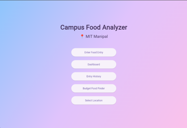
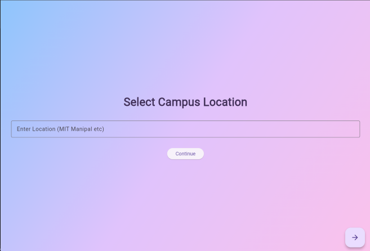
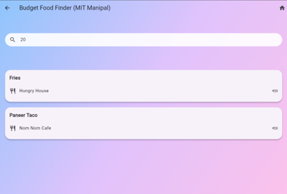
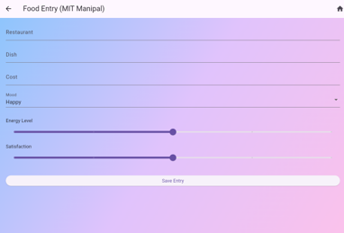
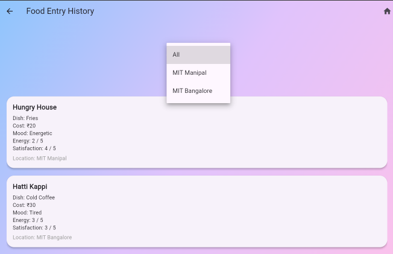
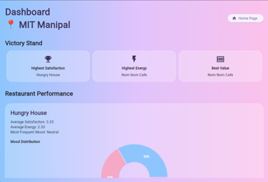
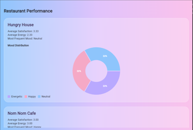

# campus_food_analyzer

A Flutter-based mobile application that helps analyze campus dining experiences through user feedback, mood tracking, and interactive performance dashboards.

## Features

- Food rating and review system
- Mood tracking after meals
- Dashboard with satisfaction analytics
- Mood distribution visualisation
- Energy return index
- Clean Flutter UI
  
## Tech Stack

- Flutter
- Dart
- Firebase

## Project Structure

~~~
lib/
assets/
android/
ios/
~~~

## How to run

1. Clone the repository
   ```bash
   git clone https://github.com/varshini120614/Campus-Food-Analyser.git
   ```

2. Install the dependencies
   ```bash
   flutter pub get
   ```

3. Run the application
   ```bash
   flutter run
   ```

## Future Improvements
 - Admin dashboard
 - AI powered food recommendations
 - More analytics
 - Push notifications

## App Screenshots

### Welcome Screen


### Location Selection


### Budget Finder


### Food Entry


### Entry History


### Dashboard


### Dashboard Analytics


## Author
 Varshini Vidya Shankar
